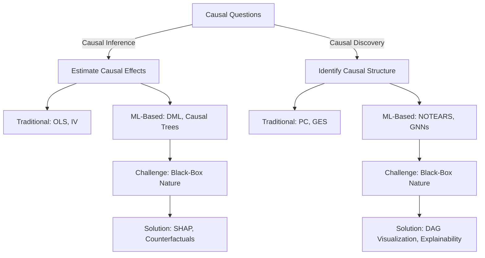

# 🎭 Addressing the Black-Box Nature of ML-Based Causal Inference & Discovery

## 📌 Introduction

Machine learning (ML) has revolutionized both causal inference (estimating causal effects) and causal discovery (identifying causal structures), providing tools that can handle complex, high-dimensional data where traditional methods struggle. However, ML-based approaches are often criticized for their black-box nature, which raises concerns about interpretability, transparency, and trust—especially in industry and policy decision-making, where explainability is crucial.

This document compares traditional causal inference (e.g., OLS, IV, Structural Equation Models) with ML-based causal inference (e.g., Double Machine Learning, Causal Forests) and similarly contrasts traditional causal discovery (e.g., PC algorithm, GES) with neural network-based causal discovery (e.g., NOTEARS). It also addresses strategies for making these ML-based methods more interpretable, ensuring they remain useful in high-stakes applications.

## 🔄 Causal Inference vs. Causal Discovery

| Feature | Causal Inference | Causal Discovery |
|---------|------------------|------------------|
| Goal | Estimate causal effects | Learn causal relationships |
| Requires Prior Knowledge? | ✅ Yes (assumes causal structure) | ❌ No (learns structure from data) |
| Example Question | "What is the effect of education on income?" | "Does education directly influence income or is there a confounder?" |
| Traditional Methods | OLS, IV, Structural Equation Models (SEM) | PC Algorithm, GES |
| ML-Based Methods | DML, Causal Forests | NOTEARS, GNN-based discovery |

## 📊 Interpretability Comparison Across Methods

| Feature | Traditional Methods | Pure ML-Based Methods | ML + Explainability Techniques |
|---------|---------------------|------------------------|--------------------------------|
| Estimates Treatment Effects? | ✅ Yes (simple effects) | ✅ Yes (complex, heterogeneous) | ✅ Yes (best of both worlds) |
| Learns Causal Structure? | ✅ Yes (limited scale) | ✅ Yes (complex networks) | ✅ Yes (with visualization) |
| Handles High Dimensions? | ❌ No (curse of dimensionality) | ✅ Yes (thousands of variables) | ✅ Yes (with feature importance) |
| Captures Non-Linearity? | ❌ Limited | ✅ High (automatic detection) | ✅ High (with explanation) |
| Interpretability | ✅ High (explicit coefficients) | ❌ Low (Black-Box) | ✅ Medium-High (SHAP, DAGs, SEM) |
| Real-World Applications | Healthcare (RCTs), Economics | Digital Marketing, Personalized Medicine, Recommendation Systems | Tech Giants (Meta, Amazon, Microsoft), Healthcare AI |
| Computational Scalability | ❌ Poor with large datasets | ✅ Excellent (big data ready) | ✅ Good (with optimization) |
| Industrial Adoption | ✅ Established (traditional sectors) | ✅ High (tech, digital economy) | ⚠️ Rapidly Growing (regulated industries) |



## 🏛 Traditional Causal Inference: White-Box Interpretability

### ✅ Advantages
- **Interpretability**: Coefficients have clear meanings.
- **Proven statistical properties**: (e.g., unbiasedness with IV).
- **Accepted in regulatory and policy settings**: (e.g., economics, healthcare).

### ❌ Limitations
- Linear assumptions limit flexibility.
- Fails in high-dimensional settings with many confounders.
- Struggles with heterogeneous treatment effects.

## 🤖 ML-Based Causal Inference: More Power, Less Transparency

### Examples:
- **Double Machine Learning (DML)**: Uses ML to flexibly control for confounders.
- **Causal Forests**: Captures heterogeneous treatment effects.

### ✅ Advantages
- Handles non-linearity & high-dimensional data.
- Better performance in real-world applications.
- More robust to overfitting via regularization.

### ❌ Challenges
- **Lack of transparency**: No explicit coefficients.
- **Harder to validate**: Cannot directly test significance like OLS.
- **Regulatory resistance**: Black-box models face scrutiny in industry.

### 🔎 Solution: Explainability Techniques
- SHAP values to explain model predictions.
- Counterfactual analysis for transparency.

```python
import shap

# Generate SHAP values for ML-based causal model
explainer = shap.Explainer(dml_estimator.model_t)
shap_values = explainer(X)

# Visualize feature importance
shap.summary_plot(shap_values, X)
```

## 🏛 Traditional vs. ML-Based Causal Discovery

### Traditional Causal Discovery: White-Box DAGs

Examples:
- **PC Algorithm**: Uses conditional independence tests.
- **GES (Greedy Equivalence Search)**: Searches over DAGs to find the best fit.

### ✅ Advantages
- Transparent: DAGs are explicit.
- Statistically sound: Works with well-defined assumptions.
- Industry adoption: Used in epidemiology, social sciences.

### ❌ Limitations
- Struggles with high-dimensional data.
- Computationally expensive for large datasets.
- Fails if assumptions (e.g., faithfulness) are violated.

### 🤖 Neural Network-Based Causal Discovery: Black-Box Structure Learning

Examples:
- **NOTEARS**: Uses neural networks to learn DAGs.
- **Graph Neural Networks (GNNs)**: Capture complex relationships in large datasets.

### ✅ Advantages
- Handles massive datasets better than PC/GES.
- Discovers non-linear relationships automatically.
- Less restrictive assumptions.

### ❌ Challenges
- Opaque structure: Hard to interpret how relationships are learned.
- Difficult to validate: No direct statistical significance tests.
- Regulatory concerns: Black-box models may not be accepted in policy decisions.

### 🔎 Solution: DAG Visualization & Explainability

- Visualize learned causal graphs to ensure plausibility.
- Combine with domain knowledge for validation.

```python
import networkx as nx
from notears import NotearsMLP

# Train NOTEARS model on dataset
causal_graph = NotearsMLP(X)

# Visualize the learned causal structure
nx.draw(causal_graph, with_labels=True)
```

## ⚖️ Balancing Complexity & Interpretability

| Feature | Traditional Causal Methods | ML-Based Causal Methods |
|---------|----------------------------|-------------------------|
| Interpretability | ✅ High (White-Box) | ⚠️ Improving (With XAI techniques) |
| Flexibility | ❌ Limited (Linear Assumptions) | ✅ High (Non-Linear, High-Dimensional) |
| Industry Adoption | ✅ Established in traditional fields | ✅ Dominant in tech, healthcare AI, digital economy |
| Performance in Complex Data | ❌ Weak | ✅ Strong |
| Scalability | ❌ Poor with large datasets | ✅ Excellent |
| Personalization | ❌ Limited (population averages) | ✅ Strong (individual-level insights) |

## 💡 Key Takeaway

ML-based causal inference and discovery excel at handling complex, high-dimensional data with non-linear relationships that traditional methods cannot address. While interpretability remains a challenge, modern explainability techniques are bridging this gap, making these powerful tools increasingly viable for high-stakes applications in healthcare, marketing, and policy.

## 🚀 Making ML-Based Causal Models Industry-Friendly

### 🔹 Best Practices for Interpretability
- ✅ Hybrid Approach: Start with traditional methods, then validate ML models.
- ✅ Use SHAP, DAG visualizations, and counterfactuals for transparency.
- ✅ Validate ML causal models with domain expertise.

### 🔹 Future Research Directions
- 🔬 Bridging Explainability & Performance: Developing ML models that are inherently interpretable.
- ⚖️ Regulatory Standards: Creating guidelines for deploying ML-based causal inference in policy settings.
- 🔍 Better Causal Validation Metrics: Moving beyond p-values to model-agnostic interpretability measures.

## 📚 References

1. Pearl, J. (2009). *Causality: Models, Reasoning, and Inference*. Cambridge University Press.
2. Rubin, D. B. (2005). *Causal Inference Using Potential Outcomes*. Journal of the American Statistical Association, 100(469), 322-331.
3. Chernozhukov, V., Chetverikov, D., Demirer, M., Duflo, E., Hansen, C., Newey, W., & Robins, J. (2018). *Double/debiased machine learning for treatment and structural parameters*. The Econometrics Journal, 21(1), C1-C68.
4. Lundberg, S. M., & Lee, S. I. (2017). *A unified approach to interpreting model predictions*. Advances in Neural Information Processing Systems, 30.
5. Zheng, X., Aragam, B., Ravikumar, P., & Xing, E. P. (2018). *DAGs with NO TEARS: Continuous optimization for structure learning*. Advances in Neural Information Processing Systems, 31.
6. Wager, S., & Athey, S. (2018). *Estimation and inference of heterogeneous treatment effects using random forests*. Journal of the American Statistical Association, 113(523), 1228-1242.
7. Spirtes, P., Glymour, C. N., Scheines, R., & Heckerman, D. (2000). *Causation, prediction, and search*. MIT press.
8. Bareinboim, E., & Pearl, J. (2016). *Causal inference and the data-fusion problem*. Proceedings of the National Academy of Sciences, 113(27), 7345-7352.

## ✅ Final Summary

- ML methods → Superior for complex data, personalized insights, and large-scale applications.
- Traditional methods → More interpretable, but severely limited in capability.
- The future? ML-based causal AI with integrated explainability techniques offering the best of both worlds.