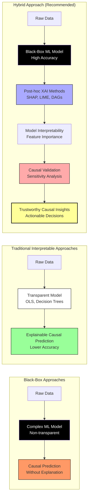

# 🎭 Addressing the Black-Box Nature of ML-Based Causal Inference

## 📌 Introduction

Machine learning-based causal inference methods, such as **Double Machine Learning (DML), CausalForestDML, and NOTEARS**, offer significant advantages over traditional statistical approaches. However, a major criticism is their **"black-box" nature**, which raises concerns about **interpretability, transparency, and trust** in industrial decision-making.

For example, while a **Random Forest** model in DML might accurately estimate treatment effects for a marketing campaign, stakeholders often cannot understand *why* certain customers respond better than others. This opacity creates a gap between statistical power and practical utility.

This document explores the **challenges of black-box causal models** and presents practical **strategies to enhance their interpretability**, making them more applicable to real-world industry settings where decision justification is as important as accuracy.

---

## ⚠️ **Challenges of Black-Box ML-Based Causal Methods**

### *The Interpretability Trade-off*

As Rudin (2019)[^1] notes, the increasing complexity of ML models often comes with decreasing interpretability, creating particular challenges for causal applications:

| Challenge | Why It Matters | Industry Example |
|-----------|---------------|------------------|
| **Lack of Transparency** | Decision-makers may struggle to trust models without knowing how causal effects are computed. | In pharmaceutical research, regulatory bodies require clear explanations of why a drug shows efficacy in certain populations. |
| **Difficult Debugging** | Unlike OLS, where coefficients provide direct interpretability, ML models require additional tools to explain relationships. | When a retail pricing algorithm produces unexpected recommendations, isolating the causal factors becomes nearly impossible without interpretability tools. |
| **Hidden Confounders** | If a model finds spurious correlations, causal claims might be misleading. | In education policy, an ML model might attribute student performance improvements to a program when socioeconomic factors are the true cause. |
| **Regulatory & Ethical Concerns** | Industries like healthcare and finance require explainability for compliance. | The EU's GDPR and "right to explanation" mandates that algorithmic decisions affecting individuals must be explainable. |



The diagram above illustrates three approaches to causal inference, highlighting the trade-offs between model complexity and interpretability. The **Hybrid Approach** represents the optimal solution that combines the high accuracy of black-box ML models with post-hoc explainability techniques, ultimately leading to trustworthy and actionable causal insights.

These challenges highlight the need for **Explainable AI (XAI) techniques** to make black-box causal models more interpretable while preserving their predictive power – what Pearl (2019)[^2] calls "the best of both worlds."

---

## 🛠 **Strategies to Improve Interpretability in ML-Based Causal Models**

Even though ML-based causal inference methods are **black-box**, they can be **explained post-hoc** using modern interpretability techniques.

### **1️⃣ Feature Importance Analysis with SHAP Values**

SHAP (SHapley Additive exPlanations) helps explain how each feature contributes to causal effect estimation.

```python
import shap

# Generate SHAP values for the ML-based causal model
explainer = shap.Explainer(dml_estimator.model_t)
shap_values = explainer(X)

# Visualize feature importance
shap.summary_plot(shap_values, X)
```

✅ Why It Helps?

- Identifies the most influential factors in causal predictions.
- Helps domain experts understand how the model makes causal decisions.

### **2️⃣ Visualizing Causal Graphs with NOTEARS**

NOTEARS is a neural network-based method that discovers causal structures by learning Directed Acyclic Graphs (DAGs).

```python
import networkx as nx
from notears import NotearsMLP

# Train NOTEARS model on dataset
causal_graph = NotearsMLP(X)

# Visualize the learned causal structure
nx.draw(causal_graph, with_labels=True)
```

✅ Why It Helps?

- Shows how different variables influence each other.
- Helps bridge the gap between black-box ML and white-box causal discovery.

### **3️⃣ Causal Model-Specific Techniques**

Certain causal inference methods are designed with interpretability in mind:

✅ Causal Trees and Forests

- Extend decision trees to estimate heterogeneous treatment effects.
- Provide clear visualizations of how treatment effects vary across different subgroups.

✅ Structural Equation Modeling (SEM)

- Represents causal relationships using equations.
- Allows straightforward interpretation of direct and indirect effects.

Example: Causal trees can help an organization understand how the impact of a training program varies among employees with different levels of experience, guiding targeted interventions.

### **4️⃣ Counterfactual Explanations: What-If Scenarios**

Counterfactual explanations test how outcomes change when input variables are modified.

```python
from econml.cate_interpreter import SingleTreeCateInterpreter

# Train an interpretable decision tree on ML-based causal effects
interpreter = SingleTreeCateInterpreter(max_depth=3)
interpreter.fit(dml_estimator, X)

# Plot decision tree explaining treatment effects
interpreter.plot(feature_names=X.columns)
```

✅ Why It Helps?

- Answers "What would happen if we changed variable X?".
- Helps industries design optimal interventions based on causal insights.

### **5️⃣ Robustness Checks: Placebo Tests & Sensitivity Analysis**

✅ Placebo Test: Shuffle Treatment Labels

- Randomizing the treatment variable should eliminate causal effects.
- If the model still finds an effect, it suggests bias or overfitting.

```python
import numpy as np

np.random.shuffle(T)  # Randomize treatment assignment
dml_estimator.fit(Y, T, X)  # Re-train model
placebo_effects = dml_estimator.effect(X)

print(f"Placebo Mean Effect: {np.mean(placebo_effects)}")
```

✅ Sensitivity Analysis: Hidden Confounders

- If unmeasured confounders exist, causal estimates may be biased.
- Sensitivity analysis quantifies how strong an unobserved confounder must be to invalidate the causal conclusion.

### **6️⃣ Integrating Explainable AI (XAI) Techniques**

Model-agnostic methods like LIME (Local Interpretable Model-Agnostic Explanations) provide explanations by approximating complex model predictions with simpler, interpretable models.

Example:

In a financial setting, LIME can help explain why a loan application was approved or denied by approximating the complex model’s decision with a simple, interpretable model, thereby increasing transparency and trust.

---

## 📊 **Comparison: Traditional vs. Black-Box Causal AI with Interpretability**

| Feature | Traditional (OLS, IV) | ML-Based (DML, NOTEARS) | ML-Based + Explainability |
|---------|----------------------|------------------------|---------------------------|
| Identifies Heterogeneous Effects | ❌ No | ✅ Yes | ✅ Yes |
| Interpretability | ✅ High | ❌ Low | ✅ Medium (with SHAP & DAGs) |
| Actionable Insights | ✅ Yes (Simple) | ❌ No (Opaque) | ✅ Yes (Counterfactuals) |

### 💡 **Key Takeaway**

ML-based causal inference becomes explainable when combined with interpretability techniques like SHAP, DAG visualization, and counterfactual analysis, bridging the gap between predictive power and practical utility.

## 🚀 **Conclusion: The Future of Interpretable Causal AI**

Despite its inherent black-box nature, ML-based causal inference provides significant value in industrial applications for several compelling reasons:

1. **Complex Relationship Modeling**: It captures non-linear and interactive effects that traditional methods cannot identify
2. **Data-Driven Discovery**: It allows for causal structures to emerge from the data rather than relying on pre-defined theoretical models
3. **Flexibility with Interpretability**: When combined with post-hoc techniques (SHAP, DAGs, counterfactuals), it delivers both accuracy and explainability

### **Practical Implementation Strategy**

To ensure trust and adoption in industries where decisions must be justified:

- Start with simple, interpretable models as baselines
- Gradually introduce ML-based causal methods with built-in explainability
- Always validate findings through domain expertise and sensitivity analyses
- Document both the statistical findings and their practical interpretations

By thoughtfully combining the statistical power of black-box ML with modern explainability tools, organizations can make causal insights transparent, robust, and ultimately actionable for stakeholders across all levels of technical expertise.

---

## 📚 **References**

[^1]: Rudin, C. (2019). Stop explaining black box machine learning models for high stakes decisions and use interpretable models instead. Nature Machine Intelligence, 1(5), 206-215.

[^2]: Pearl, J. (2019). The seven tools of causal inference, with reflections on machine learning. Communications of the ACM, 62(3), 54-60.

